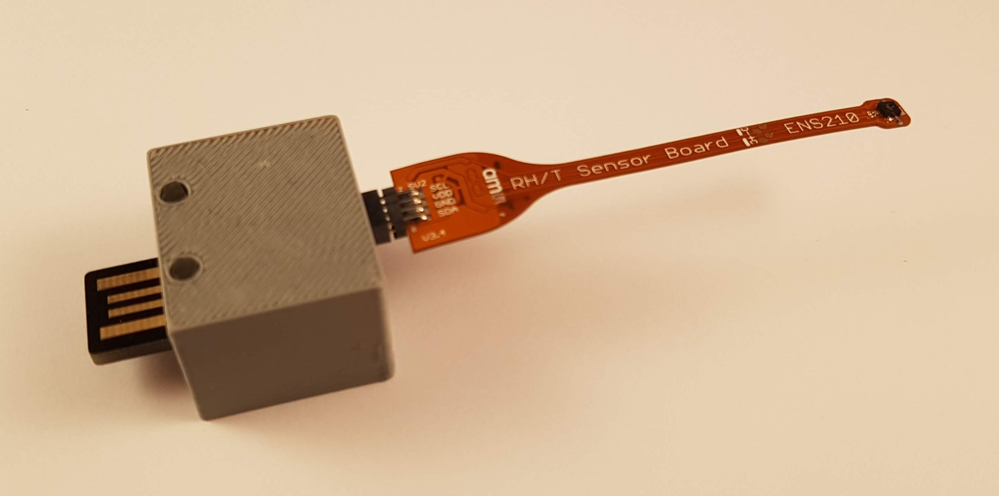
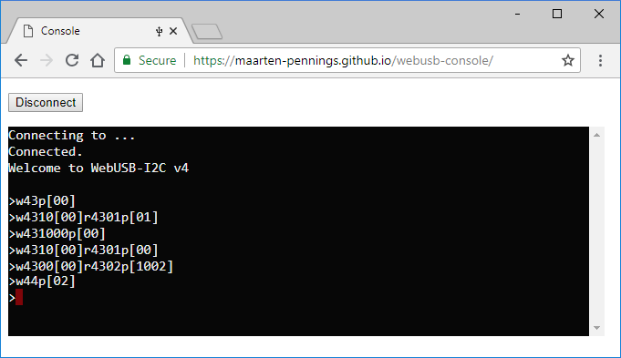
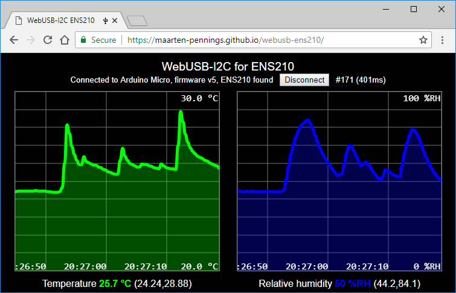

# WebUSB-I2C
Sending commands from a browser (web page with JavaScript) via a WebUSB-I2C dongle to an I2C slave.

## Introduction
This project implements a WebUSB-I2C dongle, and uses the ENS210 I2C slave as an example.

A WebUSB-I2C dongle is a dongle has a USB plug that can be plugged into a PC.
A WebUSB-I2C dongle has a second connector, which allows plugging in I2C slaves.
This connector has 4 pins (3V3, GND, SCL, SDA), and usually the I2C slave is mounted on a small PCB (a "shield").
The shield has a connector that can be mated with the connector on the dongle.

The firmware in the dongle bridges USB to I2C.
As a result, this setup allows a PC to execute I2C transactions: writing bytes to or reading bytes from the I2C slave.

There is one important design decision to make: what form does the USB interface have. There are some likely candidates.
 * The dongle uses _HID_.  
   HID is a standard USB class for _Human Interfaces Device_. 
   Since this is a standard USB class, there is no driver required for the OS.
   Another advantage is that this is a binary interface, so easy for application to send or receive bytes.
   Disadvantage is two-fold: a "HID to I2C" layer is required, and there is no easy way for a human to issue I2C transactions.
 * The dongle uses _CDC_.  
   CDC is also a standard USB class known in full as _Communications Device Class_, 
   or more simply, virtual serial port ("COM22"). Since this is a standard USB class, there is no driver required 
   for the OS (however, Windows prior to version 10 did require a driver).
   If the data over CDC is textual, it is easy for a humans to issue I2C transactions (using any terminal).
   A disadvantaged is for applications: they need to convert bytes back and forth to text.
 * The dongle uses _WebUSB_.  
   This is a new USB standard, not yet fully deployed at the moment of writing this project.
   The advantage is that a _browser_ can access the USB device. To some extend this is a security risk.
   The big advantage is that the driver for the USB device can be written in JavaScript and loaded on the fly when browsing to
   the web page for that USB device.

As the name WebUSB-I2C implies, it uses the third option.

## Components
This project has several components
 * Hardware for the WebUSB-I2C dongle.  
   This consists of an Arduino Pro Micro (and optioally an I2C level-shifter and I2C shield connector).  
   See [documentation](doc) for details of building the hardware.
 * Firmware for the WebUSB-I2C dongle.  
   This is basically an Arduino sketch. It implements a WebUSB stack
   and a command interpreter for I2C commands. Note that this firmware has a "serial" port towards the 
   web browser, but also a serial port (COMxx) towards the OS. The latter is used for debug tracing.  
   The actual source is [WebUSB-I2C.ino](WebUSB-I2C.ino) in this directory.  
   See [documentation](doc) for details on the firmware, and on the libraries used.
 * Web pages that interact with the dongle.  
    * A web page with a terminal to enter commands for the WebUSB-dongle.
    * A web page with an ENS210 driver in JavaScript that plots the temperature 
      and relative humidity reported by the ENS210 in a live graph. 
    
   These are available in the [web](web) directory in this project.

## Demos
The following screenshots show the two web pages interacting with the dongle.

### Console in action

### ENS210 in action

(end)
